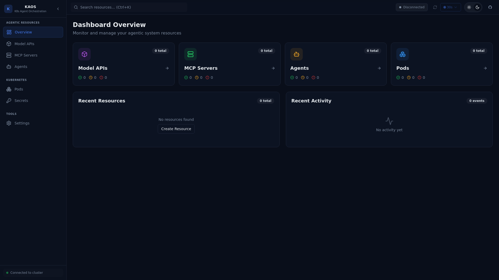

# KAOS-UI User Interface Guide

This document provides a comprehensive guide to all screens and features in KAOS-UI.

## Table of Contents

- [Dashboard Overview](#dashboard-overview)
- [Agents](#agents)
- [MCP Servers](#mcp-servers)
- [Model APIs](#model-apis)
- [Pods](#pods)
- [Secrets](#secrets)
- [Settings](#settings)
- [Common Features](#common-features)

---

## Dashboard Overview

The dashboard provides an at-a-glance view of all agentic resources in your cluster.



### Features

| Feature | Description |
|---------|-------------|
| **Resource Cards** | Quick view of Model APIs, MCP Servers, Agents, and Pods counts |
| **Status Indicators** | Green/yellow/red indicators show resource health |
| **Recent Resources** | Quick access to recently viewed or modified resources |
| **Recent Activity** | Log of recent operations and events |

### Navigation

The sidebar provides access to all sections:
- **AGENTIC RESOURCES**: Model APIs, MCP Servers, Agents
- **KUBERNETES**: Pods, Secrets
- **TOOLS**: Settings

---

## Agents

Agents are the core resource in KAOS - autonomous AI entities that can think, remember, and act.

### Agent List

The Agent list shows all deployed agents in the current namespace.

<!-- Screenshot placeholder: agents-list.png -->

| Column | Description |
|--------|-------------|
| **Name** | Agent identifier |
| **Status** | Running, Pending, Error, Unknown |
| **Model** | LLM model being used |
| **Tools** | Number of connected MCP tools |
| **Actions** | Quick actions (View, Edit, Delete) |

### Agent Detail View

Click on an agent to open the detail drawer with multiple tabs:

#### Overview Tab

Shows agent configuration and status:

<!-- Screenshot placeholder: agent-overview.png -->

- **Basic Info**: Name, namespace, creation time
- **Configuration**: System prompt, model, temperature
- **Dependencies**: Connected MCP servers and Model APIs
- **Status**: Pod health and deployment state

#### Chat Tab

Interact with the agent directly:

<!-- Screenshot placeholder: agent-chat.png -->

| Feature | Description |
|---------|-------------|
| **Message Input** | Send messages to the agent |
| **Conversation History** | View the ongoing conversation |
| **Streaming Responses** | Real-time response streaming |
| **Error Handling** | Clear error messages with retry options |

**Usage Example:**
```
You: What tools do you have available?
Agent: I have access to the following tools:
- web_search: Search the web for information
- calculator: Perform mathematical calculations
- file_reader: Read file contents
```

#### Memory Tab

Inspect the agent's memory state:

<!-- Screenshot placeholder: agent-memory.png -->

| Memory Type | Description |
|-------------|-------------|
| **Short-term** | Recent conversation context |
| **Long-term** | Persistent knowledge and facts |
| **Working** | Current task state |

#### Pods Tab

View and manage agent pods:

<!-- Screenshot placeholder: agent-pods.png -->

- **Pod Status**: Running, Pending, Failed
- **Container Logs**: Real-time log streaming
- **Actions**: Delete pod (triggers restart)

---

## MCP Servers

MCP (Model Context Protocol) Servers provide tools and capabilities to agents.

### MCP Server List

<!-- Screenshot placeholder: mcp-list.png -->

| Column | Description |
|--------|-------------|
| **Name** | Server identifier |
| **Status** | Running, Pending, Error |
| **Transport** | Communication protocol (stdio, sse) |
| **Actions** | View, Edit, Delete |

### MCP Server Detail View

#### Overview Tab

<!-- Screenshot placeholder: mcp-overview.png -->

- **Configuration**: Transport type, image, environment
- **Tools**: List of available tools
- **Connected Agents**: Agents using this server

#### Debug Tab

Test and debug tool functionality:

<!-- Screenshot placeholder: mcp-debug.png -->

| Feature | Description |
|---------|-------------|
| **Tool List** | All available tools |
| **Test Interface** | Send test requests to tools |
| **Response Viewer** | View tool responses |

#### Pods Tab

Same as Agent pods - view logs and manage containers.

---

## Model APIs

Model APIs are endpoints for Large Language Models.

### Model API List

<!-- Screenshot placeholder: modelapi-list.png -->

| Column | Description |
|--------|-------------|
| **Name** | API identifier |
| **Provider** | openai, anthropic, ollama, etc. |
| **Model** | Specific model (gpt-4, claude-3, etc.) |
| **Status** | Deployment health |

### Model API Detail View

#### Overview Tab

<!-- Screenshot placeholder: modelapi-overview.png -->

- **Provider Configuration**: API keys, endpoints
- **Model Settings**: Temperature, max tokens
- **Gateway Routes**: Ingress configuration

#### Diagnostics Tab

Test API connectivity:

<!-- Screenshot placeholder: modelapi-diagnostics.png -->

- **Health Check**: Test connection to provider
- **Latency Test**: Measure response times
- **Token Usage**: Monitor usage statistics

---

## Pods

Kubernetes pods running agentic workloads.

### Pod List

<!-- Screenshot placeholder: pods-list.png -->

| Column | Description |
|--------|-------------|
| **Name** | Pod identifier |
| **Status** | Running, Pending, Failed, etc. |
| **Ready** | Ready containers / Total containers |
| **Age** | Time since creation |
| **Actions** | View logs, Delete |

### Pod Detail View

<!-- Screenshot placeholder: pod-detail.png -->

#### Logs

Real-time log streaming with:
- **Container Selection**: Choose which container to view
- **Follow Mode**: Auto-scroll to new logs
- **Search**: Filter logs by keyword
- **Download**: Save logs to file

---

## Secrets

Kubernetes secrets for API keys and credentials.

### Secrets List

<!-- Screenshot placeholder: secrets-list.png -->

| Column | Description |
|--------|-------------|
| **Name** | Secret identifier |
| **Type** | Opaque, docker-registry, etc. |
| **Keys** | Number of data keys |
| **Age** | Time since creation |

### Create Secret

<!-- Screenshot placeholder: secrets-create.png -->

1. Click "Create Secret" button
2. Enter secret name
3. Add key-value pairs
4. Submit to create

**Security Note:** Secret values are masked by default and stored encrypted in Kubernetes.

---

## Settings

Application configuration and connection settings.

### Connection Settings

<!-- Screenshot placeholder: settings-connection.png -->

| Setting | Description |
|---------|-------------|
| **API URL** | Kubernetes API proxy URL |
| **Namespace** | Current working namespace |
| **Status** | Connection state |

### Appearance Settings

<!-- Screenshot placeholder: settings-appearance.png -->

| Setting | Description |
|---------|-------------|
| **Theme** | Light, Dark, System |
| **Auto-refresh** | Enable/disable auto-refresh |
| **Refresh Interval** | Polling interval (5s-120s) |

### Connection Diagnostics

<!-- Screenshot placeholder: settings-diagnostics.png -->

Test connectivity to:
- Kubernetes API
- Custom Resources (Agents, MCPServers, ModelAPIs)
- CRUD operations

---

## Common Features

### Global Search

Press `Ctrl+K` (or `Cmd+K` on Mac) to open global search:

<!-- Screenshot placeholder: global-search.png -->

- Search across all resource types
- Filter by namespace
- Quick navigation to resources

### Namespace Switching

Click the namespace indicator in the header to switch namespaces:

<!-- Screenshot placeholder: namespace-switch.png -->

- All resources refresh for the new namespace
- Settings are preserved

### Theme Toggle

Click the sun/moon icon in the header to toggle between light and dark themes.

### Auto-Refresh

Configure auto-refresh in the header:
- Green indicator: Auto-refresh enabled
- Click to toggle or change interval
- Countdown shows time until next refresh

### Error Boundary

If an error occurs, the error boundary provides:

<!-- Screenshot placeholder: error-boundary.png -->

- Error message and stack trace
- "Report Issue on GitHub" button
- "Try Again" to recover

---

## Keyboard Shortcuts

| Shortcut | Action |
|----------|--------|
| `Ctrl/Cmd + K` | Open global search |
| `Escape` | Close dialogs and drawers |
| `r` | Refresh resources (when focused) |

---

## URL Parameters

KAOS-UI supports URL parameters for deep linking:

| Parameter | Example | Description |
|-----------|---------|-------------|
| `kubernetesUrl` | `https://my-proxy.example.com` | Kubernetes API URL |
| `namespace` | `production` | Default namespace |

**Example:**
```
https://axsaucedo.github.io/kaos-ui/?kubernetesUrl=https://my-proxy.com&namespace=kaos-hierarchy
```

---

## Troubleshooting

### Connection Issues

1. **CORS Errors**: Ensure your proxy allows CORS
2. **Timeout**: Check network connectivity
3. **Auth Errors**: Verify RBAC permissions

### Missing Resources

1. Check you're in the correct namespace
2. Verify CRDs are installed
3. Check pod/deployment status

### UI Not Updating

1. Try manual refresh (click refresh icon)
2. Check auto-refresh is enabled
3. Check for errors in browser console

---

## Screenshots Gallery

> **Note:** To add actual screenshots to this documentation:
> 
> 1. Open KAOS-UI connected to a cluster with resources
> 2. Navigate to each screen
> 3. Take screenshots in dark mode
> 4. Save to `docs/screenshots/` folder
> 5. Update the image references above

### Required Screenshots

- [ ] `dashboard-overview.png` - Main dashboard ✅
- [ ] `agents-list.png` - Agent list view
- [ ] `agent-overview.png` - Agent detail overview tab
- [ ] `agent-chat.png` - Agent chat interface
- [ ] `agent-memory.png` - Agent memory viewer
- [ ] `agent-pods.png` - Agent pods tab
- [ ] `mcp-list.png` - MCP Server list
- [ ] `mcp-overview.png` - MCP Server overview
- [ ] `mcp-debug.png` - MCP debug panel
- [ ] `modelapi-list.png` - Model API list
- [ ] `modelapi-overview.png` - Model API overview
- [ ] `modelapi-diagnostics.png` - Model API diagnostics
- [ ] `pods-list.png` - Pods list
- [ ] `pod-detail.png` - Pod detail with logs
- [ ] `secrets-list.png` - Secrets list
- [ ] `secrets-create.png` - Create secret dialog
- [ ] `settings-connection.png` - Connection settings
- [ ] `settings-appearance.png` - Appearance settings
- [ ] `settings-diagnostics.png` - Connection diagnostics
- [ ] `global-search.png` - Global search modal
- [ ] `namespace-switch.png` - Namespace switcher
- [ ] `error-boundary.png` - Error boundary screen

---

*Last updated: January 2026*
